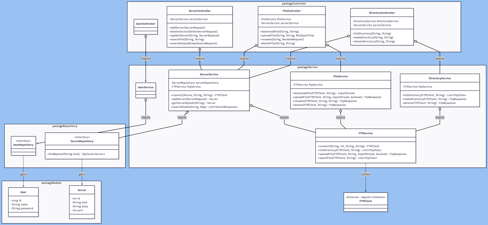
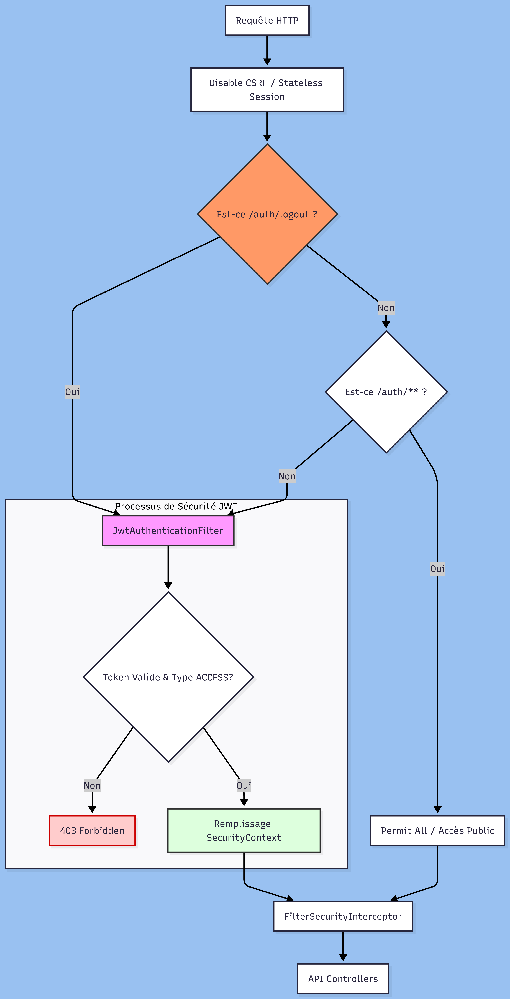
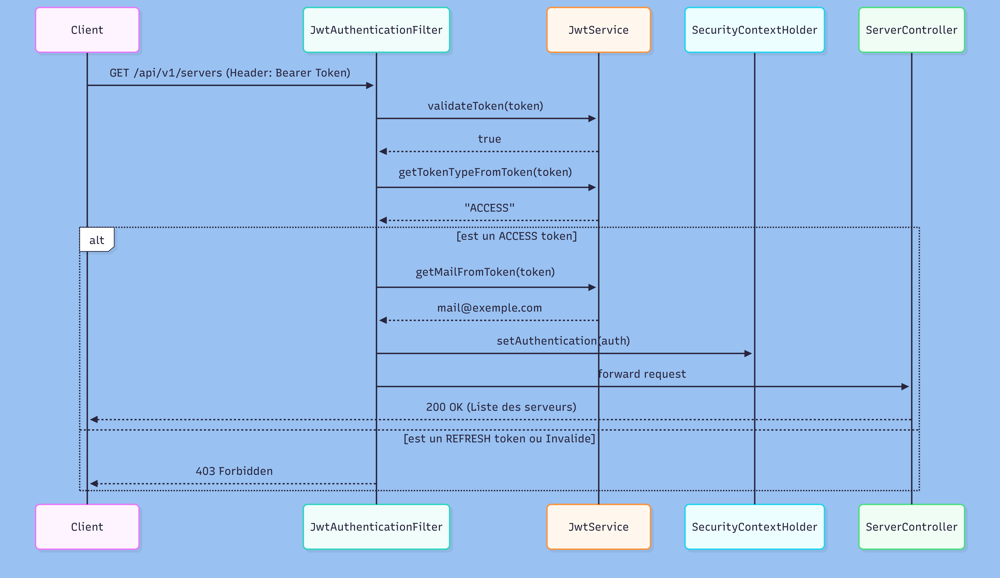

# FlopBox — Proxy REST pour serveurs FTP
Assane Kane  
Mars 2026

---

## Introduction

FlopBox est un proxy REST permettant à un client HTTP de piloter des serveurs FTP distants sans implémenter le protocole FTP lui-même. L'application centralise l'enregistrement de serveurs FTP (hôte, port, alias) dans une base H2 en mémoire, puis expose des endpoints REST pour lister, créer, renommer, supprimer des fichiers et répertoires, et effectuer des recherches récursives mono- ou multi-serveurs. Le cœur technique repose sur la bibliothèque Apache Commons Net pour la communication FTP et Spring Boot 3.4.3 pour la couche REST.

---

## Instructions de build et d'exécution

### Prérequis

- Java 21
- Maven 3.9+ 

### Compilation et packaging

```bash
./mvnw clean package 
```

Le JAR exécutable est généré dans `target/flopbox-1.0.0.jar`.

### Lancement

```bash
java -jar target/flopbox-1.0.0.jar
```

L'application démarre sur le port **8080**. La documentation Swagger UI est disponible à `http://localhost:8080/swagger-ui.html`.

### Exécution des tests

```bash
./mvnw test
```

---

## Architecture

### Diagramme  de classe flopbox



### Diagramme de séquence `/api/v1/servers/search`


### Classes utils

`FtpInputStream` étend `FilterInputStream`. Ce wrapper surcharge la méthode `close()` pour clore proprement une connexion FTP en cours de streaming lors de téléchargement d'un fichier : fin de commande FTP (`completePendingCommand`), déconnexion (`logout` + `disconnect`).

### Méthodes polymorphiques

- `FtpInputStream.close()` surcharge `FilterInputStream.close()` pour ajouter le cycle de vie FTP.
- `DatabaseInitializer.run(String... args)` implémente `CommandLineRunner.run()` pour l'initialisation de la base au démarrage.

### Pattern façade 

`DirectoryService` et `FileService` sont deux façades au-dessus de `FTPService`. Chaque contrôleur ne connaît que la façade qui le concerne, ce qui limite le couplage.

### Pattern Adaptor 

`FtpHttpStatusAdaptator` adapte les code ftp du serveur ftp en code httpstatus et en httpcode pour l'api REST.


### Pattern DTO
`DTO`  est utilisé pour transporter des données entre les processus afin de réduire le nombre d'appels de méthodes ou de masquer la structure interne de la base de données. Par exemple, ServerRequest permet de créer un serveur sans exposer l'ID généré par la base de données au client, séparant ainsi l'entité JPA Server de la couche de présentation.

## Sécurité 


### Vue d'ensemble

FlopBox utilise une authentification **sans état (stateless)** basée sur des jetons JWT signés avec l'algorithme HMAC-SHA512. Chaque requête sur un endpoint protégé doit contenir un `Authorization: Bearer <token>` valide dans ses en-têtes HTTP.

Deux types de tokens coexistent :

| Type | Durée | Rôle |
|---|---|---|
| **ACCESS** | 15 minutes (`jwt.access.expiration=900000`) | Autoriser l'accès aux endpoints protégés |
| **REFRESH** | 7 jours (`jwt.refresh.expiration=604800000`) | Obtenir un nouvel access token sans se reconnecter |

Le refresh token est stocké en base de données (table `refreshtoken`) et est invalidé à chaque déconnexion ou à la génération d'un nouveau refresh token.

### Configuration de la chaîne de filtres



### Diagramme de séquence — Accès à un endpoint protégé (GET /api/v1/servers)



#### Inscription — `POST /api/v1/auth/register`


#### Diagramme séquence Connexion — `POST /api/v1/auth/login`


[Diagramme séquence - connetion](doc/diagramme_sequence_login.png)

---

## Gestion des erreurs

### Détection d'erreurs — `throw new`

| Lieu | Exception levée | Condition |
|---|---|---|
| `FTPService.connect()` | `throw new IOException("Le serveur FTP a refusé la connexion.")` | Code de réponse FTP négatif |
| `FTPService.connect()` | `throw new IOException("Échec de l'authentification ...")` | Login FTP échoué |
| `FTPService.downloadFile()` | `throw new IOException("Erreur FTP " + replyCode + " : " + replyMessage)` | Stream de téléchargement null |
| `ServerService.addServer()` | `throw new RuntimeException("Un serveur avec cet hôte existe déjà.")` | Hôte déjà présent en base |
| `ServerService.deleteServer()` | `throw new RuntimeException("Serveur non trouvé ...")` | Hôte absent de la base |
| `ServerService.getServerByHost()` | `throw new RuntimeException("Serveur non trouvé ...")` | Hôte absent de la base |
| `ServerService.updateServer()` | `throw new RuntimeException("Serveur non trouvé ...")` | Hôte cible absent de la base |
| `ServerService.updateServer()` | `throw new RuntimeException("Un serveur avec ce nouvel hôte existe déjà.")` | Collision sur le nouvel hôte |


---

## Code Samples

### 1. Fermeture propre d'un flux FTP en streaming

`FtpInputStream` étend `FilterInputStream` pour garantir que la connexion FTP est fermée après que Spring a fini de streamer la réponse HTTP au client.

```java
// Le contrôleur retourne InputStreamResource wrappant ce flux.
// Spring appelle close() une fois le corps HTTP entièrement envoyé.
@Override
public void close() throws IOException {
  try {
    super.close(); // fermeture du flux de données
  } finally {
    try {
      if (ftpClient != null && ftpClient.isConnected()) {
        ftpClient.completePendingCommand(); // acquittement FTP obligatoire
        ftpClient.logout();
        ftpClient.disconnect();
      }
    } catch (IOException e) {
      log.error("Erreur déconnexion FTP après téléchargement : {}", e.getMessage());
    }
  }
}
```

### 2. Recherche récursive avec double garde-fou

La méthode `seachFile` parcourt l'arborescence FTP récursivement. Deux conditions de sortie anticipée évitent un parcours infini : un plafond sur le nombre de résultats et une profondeur maximale.

```java
public void seachFile(FTPClient ftp, String path, String query,
                      List<FtpItem> res, int depth) throws IOException {
  if (res.size() >= 5 || depth >= 3) return; // double garde-fou
  try {
    for (FtpItem f : this.listDirectory(ftp, path)) {
      if (f.name().equals(".") || f.name().equals("..")) continue;
      if (f.name().toLowerCase().contains(query.toLowerCase())) {
        res.add(f);
        if (res.size() >= 5) return;
      }
      if (f.type() == Type.DIRECTORY)
        seachFile(ftp, f.path(), query, res, depth + 1); // appel récursif
    }
  } catch (IOException e) {
    log.warn("Impossible de lire le dossier {} : {}", path, e.getMessage());
    // Exception silencieuse : un dossier inaccessible ne bloque pas la recherche
  }
}
```

### 3. Table de correspondance FTP → HTTP

`FtpHttpStatusAdaptator` traduit les codes de réponse FTP (RFC 959) en codes HTTP standards via un `switch` expressif de Java 14+, évitant une longue chaîne de `if/else`.

```java
public static HttpStatus mapFtpCodeToHttpStatus(int ftpCode) {
  if (ftpCode == 257) return HttpStatus.CREATED;     // MKD réussi → 201
  if (ftpCode >= 200 && ftpCode < 400) return HttpStatus.OK;
  return switch (ftpCode) {
    case 431, 530, 532 -> HttpStatus.UNAUTHORIZED;   // auth échouée → 401
    case 550            -> HttpStatus.NOT_FOUND;      // fichier absent → 404
    case 450, 451, 452  -> HttpStatus.CONFLICT;       // ressource occupée → 409
    case 552            -> HttpStatus.INSUFFICIENT_STORAGE; // quota → 507
    case 425, 426       -> HttpStatus.SERVICE_UNAVAILABLE;  // réseau → 503
    default             -> HttpStatus.INTERNAL_SERVER_ERROR;
  };
}
```

### 4. Upload FTP avec stratégie de remplacement

`FTPService.uploadFile` vérifie l'existence du fichier cible avant l'envoi et applique la règle `replace` passée en paramètre, sans lever d'exception dans les cas métier.

```java
public FtpResponse<Void> uploadFile(FTPClient ftp, String path,
                                    InputStream in, boolean replace) {
  try {
    ftp.setFileType(FTP.BINARY_FILE_TYPE);
    ftp.enterLocalPassiveMode();
    String[] existing = ftp.listNames(path);
    boolean exists = (existing != null && existing.length > 0);
    if (exists && !replace)
      return new FtpResponse<>(false,
        "Le fichier existe déjà et le remplacement n'est pas autorisé", 450, null);
    try (in) {
      boolean ok = ftp.storeFile(path, in);
      int code  = ftp.getReplyCode();
      if (!ok) return new FtpResponse<>(false, "Échec de l'upload : "
                                        + ftp.getReplyString(), code, null);
      return new FtpResponse<>(true, "Upload terminé avec succès", code, null);
    }
  } catch (IOException e) {
    return new FtpResponse<>(false,
      "Erreur réseau pendant l'upload : " + e.getMessage(), 500, null);
  }
}
```

### 5. Recherche globale tolérante aux pannes

`ServerService.searchGlobal` itère sur une collection de serveurs. Une exception sur un serveur (hors-ligne, mauvais mot de passe) est interceptée localement : les résultats des autres serveurs sont tout de même retournés.

```java
for (ServerCredentials creds : credentials.values()) {
  FTPClient ftpClient = null;
  try {
    Server server = serverRepository.findByHost(creds.host())
      .orElseThrow(() -> new RuntimeException(
        "Le serveur " + creds.host() + " n'est pas enregistré."));
    ftpClient = this.connect(server, creds.username(), creds.password());
    List<FtpItem> res = searchFile(ftpClient, searchQuery);
    resGlobal.addAll(res.stream()
      .map(item -> new SearchResponse(item, ServerRequest.toRequest(server)))
      .toList());
  } catch (Exception e) {
    // Ce serveur est ignoré ; la recherche continue sur les suivants
    log.warn("Impossible de chercher dans {} : {}", creds.host(), e.getMessage());
  } finally {
    if (ftpClient != null) this.disconnect(ftpClient); // toujours déconnecté
  }
}
```

### 6. Génération d'un token JWT typé

`JwtService.generateToken` produit un token JWT signé HMAC-SHA512 avec un claim `token_type` qui distingue les access tokens des refresh tokens, empêchant leur usage croisé.

```java
public String generateToken(User user, Long expiryTimeMs, TypeToken type) {
  return Jwts.builder()
    .subject(user.getMail())
    .issuedAt(new Date())
    .expiration(new Date(System.currentTimeMillis() + expiryTimeMs))
    .claim("token_type", type)   // ACCESS ou REFRESH
    .signWith(key)               // HMAC-SHA512 avec clé 512 bits
    .compact();
}
```


### 7. Filtre JWT — vérification du type de token

`JwtAuthenticationFilter` extrait et valide le token, mais ne peuple le `SecurityContextHolder` que si `token_type == "ACCESS"`. Un refresh token valide ne peut donc pas servir à accéder aux ressources protégées.

```java
@Override
protected void doFilterInternal(HttpServletRequest request,
                                HttpServletResponse response,
                                FilterChain filterChain) throws ServletException, IOException {
  String authHeader = request.getHeader("Authorization");
 
  if (authHeader != null && authHeader.startsWith("Bearer ")) {
    String token = authHeader.substring(7);
 
    if (jwtService.validateToken(token)) {
      String type = jwtService.getTokenTypeFromToken(token);
 
      if (TypeToken.ACCESS.toString().equals(type)) {        // ← garde-fou sur le type
        String mail = jwtService.getMailFromToken(token);
        UsernamePasswordAuthenticationToken auth =
          new UsernamePasswordAuthenticationToken(mail, null, new ArrayList<>());
        auth.setDetails(new WebAuthenticationDetailsSource().buildDetails(request));
        SecurityContextHolder.getContext().setAuthentication(auth);
      }
    }
  }
  filterChain.doFilter(request, response);
}
```

## Ressources consultées

- [JJWT](https://github.com/jwtk/jjwt) – Bibliothèque pour la gestion des jetons JWT
- [jwtsecrets.com](https://jwtsecrets.com/) - pour la génération de la clé 512bits